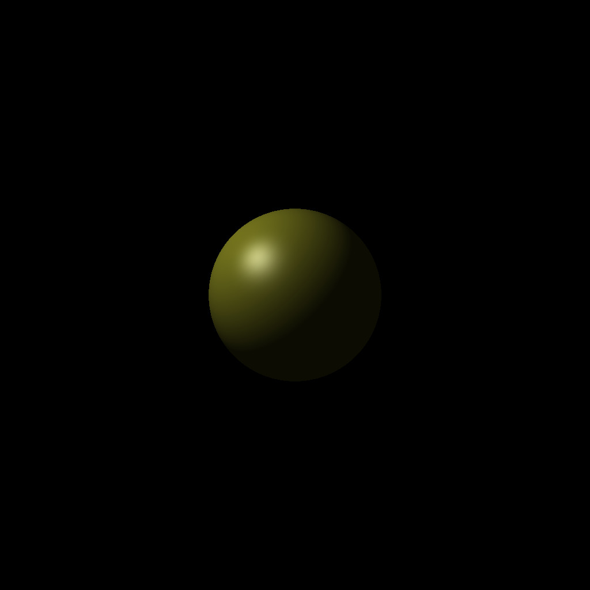
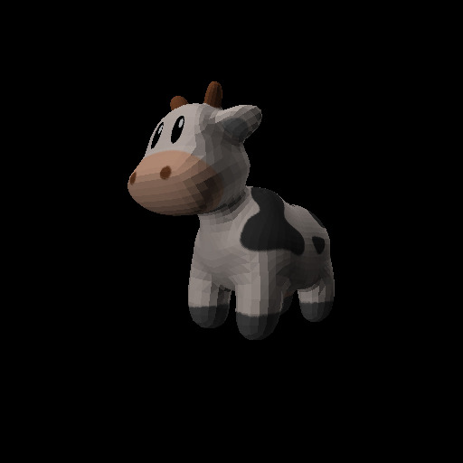

# Raytracer

Building and Running
---------------------
This project uses a Makefile to build the source code, so either a linux system
must be used or something like GnuWin32 must be installed on your windows computer. 
To build, go to the root of the project directory and run the following command:

    $ make

To run the raytracer, after building the files run the following command replacing <scenefile.txt> 
with a correctly formated .txt file that describes the scene:

    $ ./raytracer <scenefile.txt>

The time to render the scene will depend on the complexity of the scene, but once finished the 
program will output a .ppm file with the same name as the input scene text file.

Sample Scenes
---------------------
Some sample scenes are shown below:

This scene was created using the example_scene.txt file found in the scenes directory.

This scene was created using the cow.txt scene found in the scenes directory.

